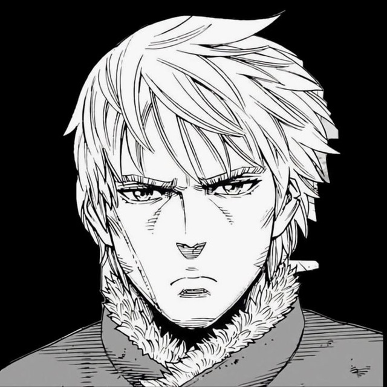
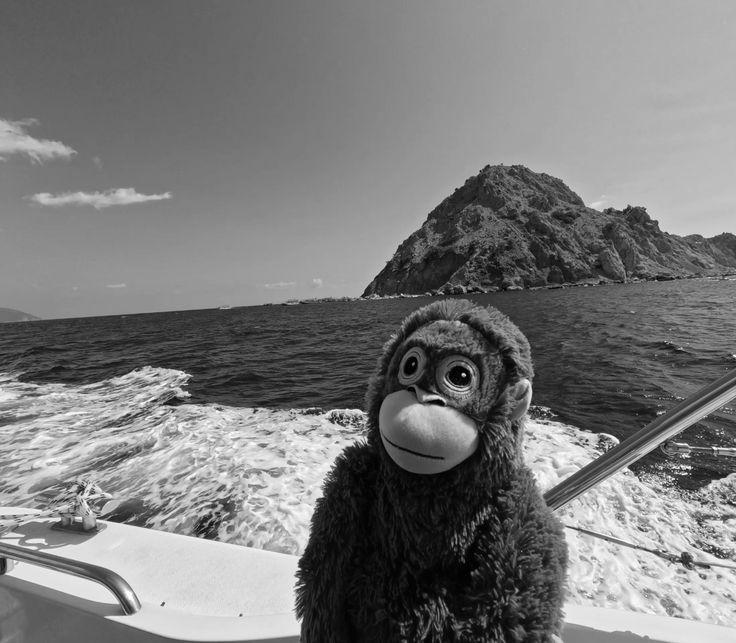
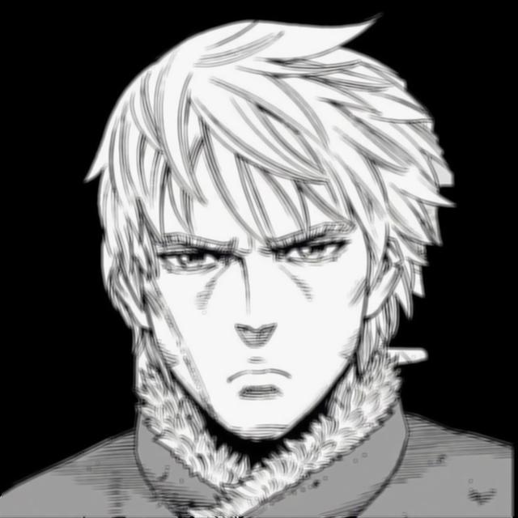
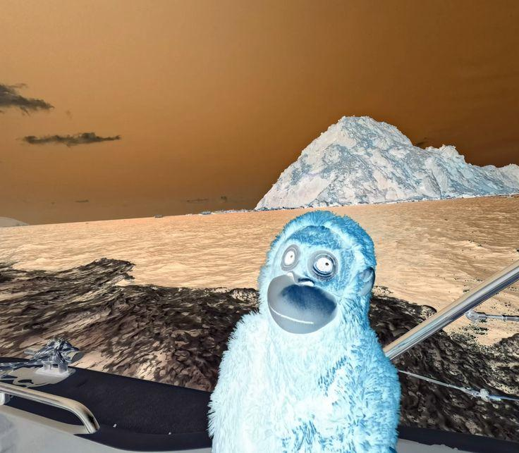
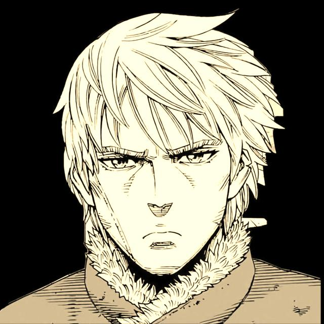
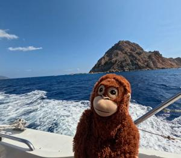

# PatchVision

A CLI project for local image processing in Python using **Typer** and **Pillow**.

## What it can do

- `info` — show file information
- `show-size` — show image size
- `grayscale` — convert image to grayscale
- `blur` — apply blur
- `invert` — invert colors
- `sharpen` — sharpen
- `sepia` — apply sepia tone
- `upscale` — double the image size
- `resize` — resize
- `resize-keep-aspect` — resize while maintaining aspect ratio
- `center-crop` — crop image to center
- `pipeline` — batch process all images from the `photos` folder

## Results preview

### Original



<table>
  <tr>
    <td align="center"><b>Grayscale</b></td>
    <td align="center"><b>Blur</b></td>
  </tr>
  <tr>
    <td></td>
    <td></td>
  </tr>
  <tr>
    <td align="center"><b>Invert</b></td>
    <td align="center"><b>Sepia</b></td>
  </tr>
  <tr>
    <td></td>
    <td></td>
  </tr>
</table>

## Geometry

<table>
  <tr>
    <td align="center"><b>Resize 300×300</b></td>
    <td align="center"><b>Resize keep aspect</b></td>
    <td align="center"><b>Center crop</b></td>
  </tr>
  <tr>
    <td></td>
    <td></td>
    <td></td>
  </tr>
</table>

## What you need

Before starting You need:

1. Install Python 3.12+.
2. Clone the repository.
3. Install dependencies.
4. Place your images in the photos/ folder.
5. Run commands using python main.py ....

## Installation

### Option 1 — via `uv`

```bash
git clone https://github.com/mif44/PatchVision.git
cd PatchVision
uv sync
```

Running help:

```bash
uv run python main.py --help
uv run python main.py image --help
uv run python main.py pipeline --help
```

### Option 2 — via `venv` and `pip`

```bash
git clone https://github.com/mif44/PatchVision.git
cd PatchVision
python -m venv .venv
```

**Windows:**

```bash
.venv\Scripts\activate
pip install pillow typer
```

**macOS / Linux:**

```bash
source .venv/bin/activate
pip install pillow typer
```

Running help:

```bash
python main.py --help
python main.py image --help
python main.py pipeline --help
```

## How to run a project as a user

### 1. Place an image in `photos/`

For example:

```text
photos/test.jpg
```

The commands search for a file in the `photos` folder by name and support the extensions `.jpg`, `.jpeg`, `.png`.

### 2. Run the desired command

#### File Information

```bash
python main.py image info test
python main.py image show-size test
```

#### Effects

```bash
python main.py image grayscale test
python main.py image blur test
python main.py image invert test
python main.py image sharpen test
python main.py image sepia test
python main.py image upscale test
```

#### Resizing

```bash
python main.py image resize test 300 300
python main.py image resize-keep-aspect test 300 300
python main.py image center-crop test 300 300
```

#### Batch Processing

```bash
python main.py pipeline
```

## Where the result is saved

- `grayscale` → `assets/grayscale/`
- `blur` → `assets/blur/`
- `invert` → `assets/invert/`
- `sharpen` → `assets/sharpen/`
- `sepia` → `assets/sepia/`
- `upscale` → `assets/upscale/`
- `resize` → `assets/resize/`
- `resize-keep-aspect` → `assets/resize_keep_aspect/`
- `center-crop` → `assets/center_crop/`
- `pipeline` → `assets/output/`

## Pipeline

The `python main.py pipeline pipeline` command traverses the `photos/` folder, processes only `.jpg`, `.jpeg`, and `.png` files, skips unsuitable images, and saves the final result in `assets/output/`.

An image passes through the pipeline only if:

- width is not less than 256
- height is not less than 256
- aspect ratio is not greater than 1.15

After this, the pipeline:

1. resizes the image to a 256x256 frame while maintaining aspect ratio
2. center crops to 224x224
3. applies sharpen
4. saves the file to assets/output/
